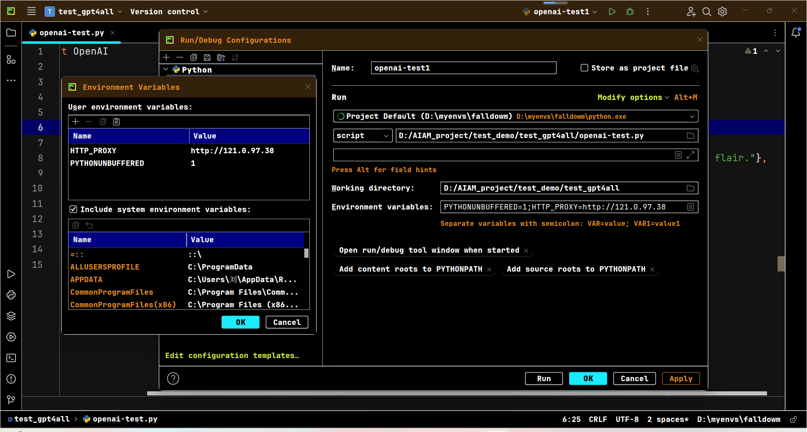

#### mediapipe

在实际使用中只使用了这些点的一部分，具体的实现细节在myFunction/FilteringKeyPoints2.py中体现

mediapipe的官方文档：

https://mediapipe.readthedocs.io/en/latest/solutions/pose.html

https://developers.google.com/mediapipe/solutions/vision/pose_landmarker

每张图片的**pose_landmarks**    

for landmark in pose_landmarks.landmark:  

有33个landmark（点）

每个landmark：landmark.x, landmark.y, landmark.z, landmark.visibility

如果关键点被遮挡或者无法可靠检测到,Mediapipe在返回结果时,对应关键点的信心度(visibility)会很低，通常设置的阈值为0.1，小于0.1认为没有检测成功

- pose_landmarks 是相机坐标系下的关键点坐标,单位是像素,原点在图片左上角。
  x - 当前关键点中心在图像宽度方向的归一化坐标(0~1)。0表示最左,1表示最右。
  y - 当前关键点中心在图像高度方向的归一化坐标(0~1)。0表示最上,1表示最下。
  z - 额外的深度坐标,默认为0。2D检测时一般不用考虑。
  这些坐标都是经过归一化的,方便应用在不同分辨率的图像上。

- pose_world_landmarks 是世界空间坐标系下的关键点坐标,单位是米,原点在房间的地板中心。

有个缺点： 如果被遮挡，会返回点，但是可信度会降低，
所以暂时大概率主要适用于无遮挡的情况

0 - nose

1 - left eye (inner) 2 - left eye 3 - left eye (outer) 4 - right eye (inner) 5 - right eye 6 - right eye (outer)

7 - left ear 8 - right ear

9 - mouth (left) 10 - mouth (right)

11 - left shoulder 12 - right shoulder

13 - left elbow 14 - right elbow

15 - left wrist 16 - right wrist

17 - left pinky 18 - right pinky

19 - left index 20 - right index

21 - left thumb 22 - right thumb

23 - left hip 24 - right hip

25 - left knee 26 - right knee

27 - left ankle 28 - right ankle

29 - left heel 30 - right heel

31 - left foot index 32 - right foot index

#### 数据集

https://paperswithcode.com/datasets?task=skeleton-based-action-recognition

1.NTU RGB+D Dataset and NTU RGB+D 120 Dataset

https://rose1.ntu.edu.sg/dataset/actionRecognition/

3.HMDB: a large human motion database

https://serre-lab.clps.brown.edu/resource/hmdb-a-large-human-motion-database/#overview

#### 论文集

NTU RGB+D 120：

https://paperswithcode.com/sota/skeleton-based-action-recognition-on-ntu-rgbd-1

#### 综述

https://blog.51cto.com/u_16099335/7908113

#### openai API 文档

https://platform.openai.com/docs/overview

#### g4f

https://github.com/xtekky/gpt4free

#### 手动指定ip

PyCharm运行Python程序时使用的网络可以通过配置实现手动指定IP或代理。

主要方法是在PyCharm中配置Run/Debug配置中的环境变量。

具体步骤如下:

1. 打开正在使用的Run/Debug配置,一般在右上角有已经存在的配置。

2. 点击Edit Configurations。

3. 在Configuration窗口中,选择Environment变量标签页。

4. 单击加号图标添加变量。

5. 输入变量名`HTTP_PROXY`或`HTTPS_PROXY`,变量值填写代理的IP地址和端口,如:`http://127.0.0.1:1087`

6. 同样可以设置`NO_PROXY`来过滤不使用代理的域名。

7. 应用更改并运行程序,这时程序的网络访问会通过设置的代理或者IP路由。

注意如果要完全禁用代理,可以将系统环境变量中的相关设置暂时删除或注释。

这样就可以方便地控制PyCharm中Python程序的网络环境。包括指定固定出口IP或使用代理等。

例如之前使用的韩国结点B1 : http://121.0.97.38

使用：https://www.ip138.com/来查询ip

